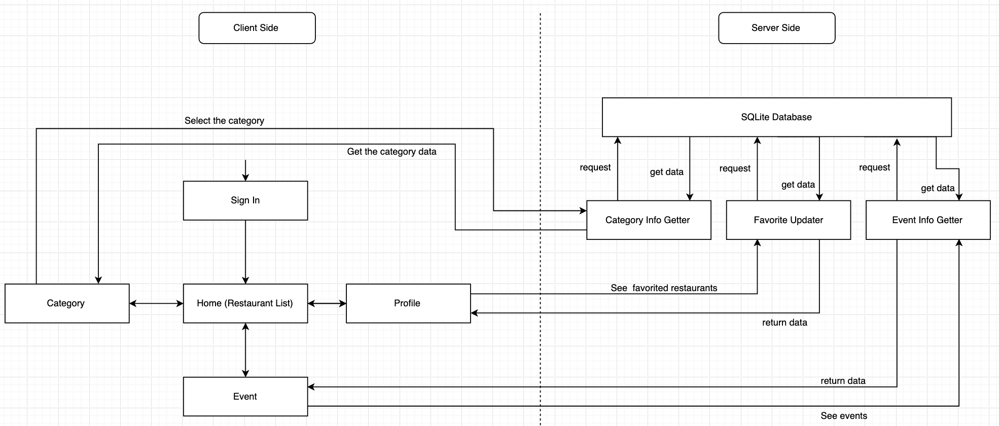

# My Yelp Restaurant Exploring Appliction (IOS)
Duke ECE564-2 Project, Team Kangaroo

## Overview
This application is the restaurants-finding application. The user can use the app to find the restaurants near him/her, and see the details of each restaurant. The user can also look at the specific restaurant by specifying the category. There is also the functionality of seeking community events near the user's current location.

## Version
Swift 4.2

Xcode 11.1

## Features
| Feature | Description |
| ------ | ------ |
| sign in/up/out | Users will be able to do basic sign in/up/out. |
| restaurant browsing | Users are able to browse restaurants nearby (within a distance of their decision). |
| restaurant searching | Users are able to search restaurants by name/ phone number |
| restaurant detail | Users are able to view detail of restaurants including name, style, rating, map, opening time and comments of the restaurants. |
| category | Users are able to see the restaurants from different categories. |
| event | Users are able to see the potential events that will be held around him/her. |
| seasonal effects | There are 4 different UI; The UI changes according to the current season. |

## Storyboard
### 1. Location Permission
Ask the user for giving a permission about specifing his/her current location.
### 2. Navigation Controller
For the purpose of showing the detail of each restaurant.
### 3. Restaurants List
Showing the list of restaurants near the user.
### 4. Restaurant Detail
Showing the detailed information of the restaurant selected.

## Context
